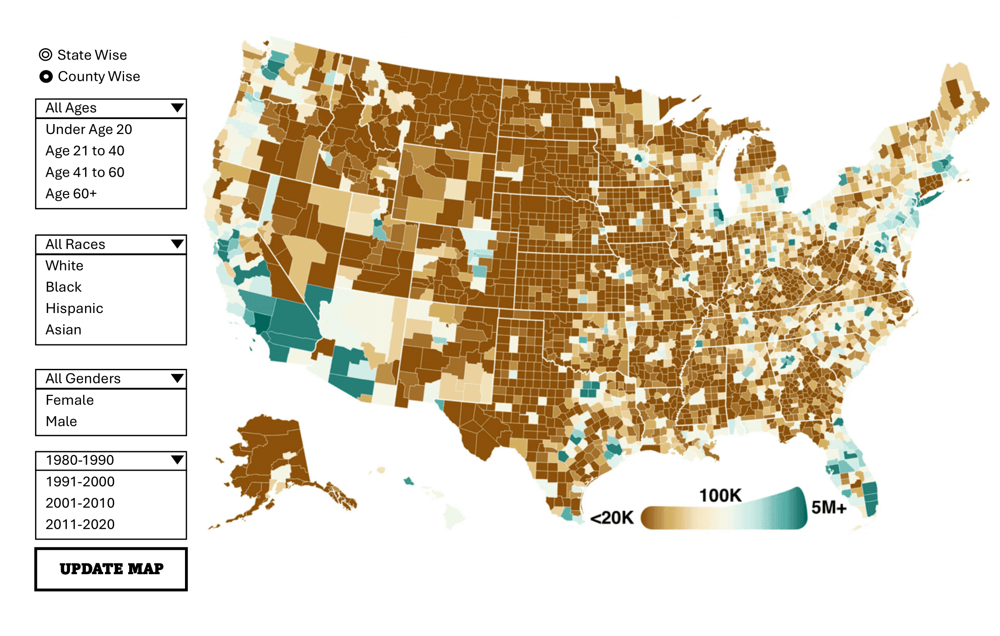

# Raabiyaal Ishaq

## Description

I intend to make an interactive US map where users will have the option to 
view migration per decade from 1950 to 2010 by state or by county. 
They will have a dragdown option where they can select to see data for 
specific age brackets or race or gender
I can either allow them to view for each decade separately or have a short 
video/time lapse start from 1950 to 2010
I plan to use a choropleth map with states or counties shaded by color.

## Technical Plan re: Option A/B/C/D
Option C

**Plan:** I plan to show U.S. migration trends, which are best visualized on a map. 
Migration is inherently geographic, so a geospatial approach will highlight regional differences clearly.

**Libraries:**
Pandas or GeoPandas to clean data
HTML / CSS / JavaScript to structure 
Pydeck / Altair for actual visualization

**Inspiration**
I drove inspiration from Visualization 2 of https://mmbarrosmigrationviz.netlify.app/
and then when trying to find the data I found the map on https://netmigration.wisc.edu/

## Mockup

## Data Sources

### Data Source 1: Net Migration Patterns 

URL: [{URL}](https://netmigration.wisc.edu/)

Size: 3174 rows per decade i.e. 3174 x 6, 49 columns

The data has state wise and county wise net migration data for the US. It is also segregated into gender, race and age brackets.

### Data Source 2: U.S. Census Bureau Migration Data   

URL: https://www.census.gov/data/tables/time-series/demo/geographic-mobility/state-to-state-migration.html  

Size: Variable by year   

Description: State-level migration flows providing inflow/outflow counts used to

validate or complement the Net Migration Patterns dataset.

## Questions

1. Please suggest the best library I should be using for the project.
2. Should I think about showing flow of migrants with moving dots on the map or
 the cloropleth would be enough?
3. Should I also have tooltips which would give specific details for each state/county?
4. Are there any preferred color schemes I should follow for this project?